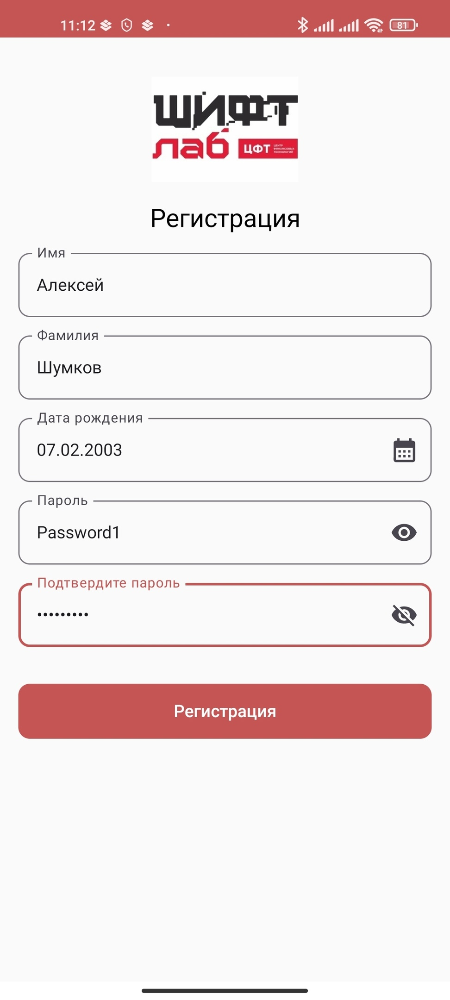
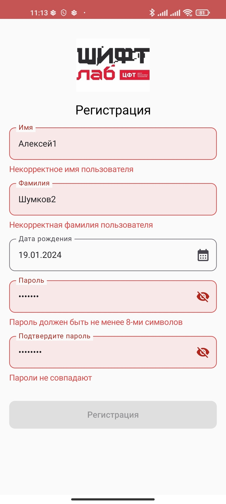
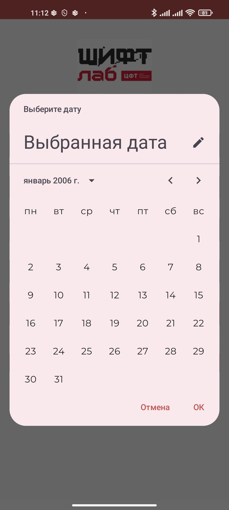
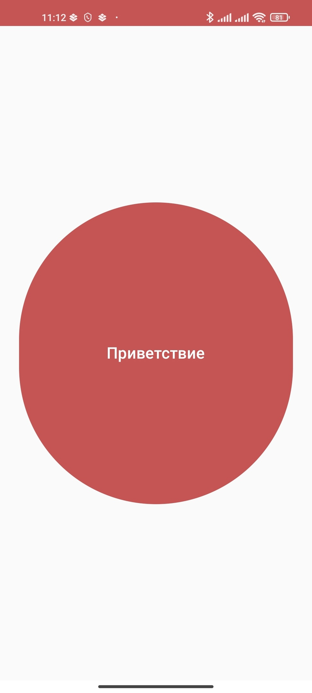
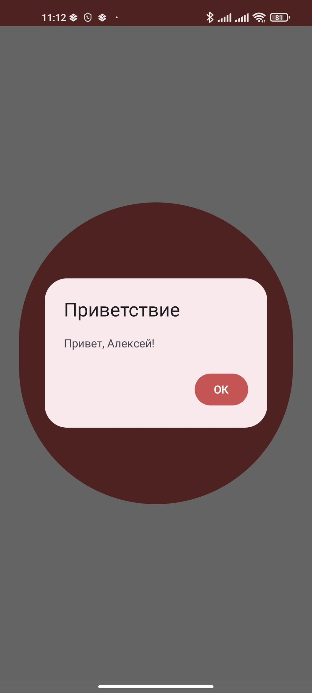

# Тестовое задание для SHIFT-Lab

Проект, выполненный в рамках тестового задания в ЦФТ ШИФТ Лаб.

Выполненные задачи:
+ Реализован экран регистрации с валидацией полей
+ Реализован переход на главный экран при успешной регистрации
+ Реализован главный экран с кнопкой, при нажатии на которую открывается модальное окно — приветствие пользователя с указанием имени, которое было введено на самом первом экране регистрации
+ Реализован интерактивный выбор даты рождения
+ Реализованы уведомления о конкретных ошибках валидации на полях во время регистрации
+ Кнопка «Регистрация» недоступна для нажатия, пока все поля не будут валидными
+ Реализовано кеширование данных и сохранение сессии: если пользователь единожды прошёл регистрацию, то следующий запуск приложения будет начинаться с главного экрана

## Использованные технологии

- ##### Jetpack Compose
- ##### Jetpack Navigation
- ##### Clean Architecture
- ##### MVI Architecture
- ##### Shared Preferences

## Скриншоты

    
    
    
    
    

